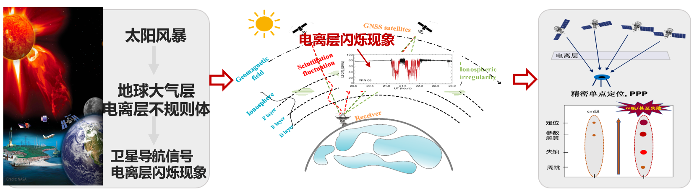
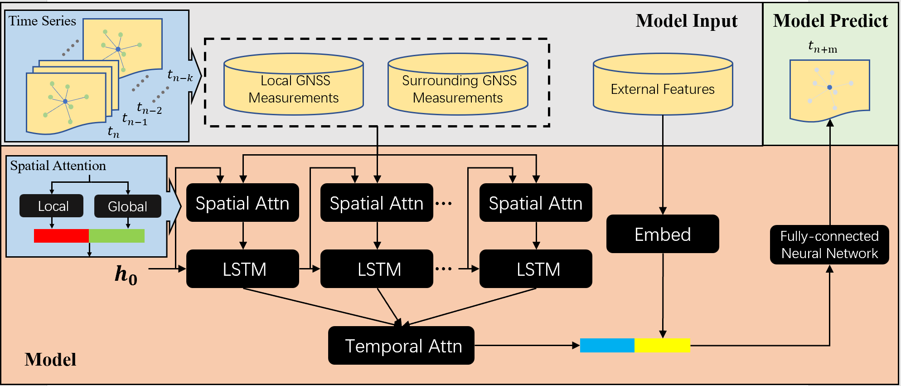

项目motivation：

影响卫星定位精度的因素有很多，比如卫星星历误差、对流层和电离层干扰、接收机误差等，其中以电离层干扰的误差影响最大，在外太空太阳风的影响下，电离层的电子会被扰动产生振幅和相位的变化，即电离层闪烁现象。这种现象对地面定位的误差能达到十米的数量级。这种级别的误差虽然对我们日常的定位服务影响不大，但在一些定位精度达厘米级的关键领域（例如军方应用），有着不可忽视的潜在危害。本项目则利用一些地面GNSS观测站的定位观测信息以及一些对外太空重点参数的观测信息数据，对其分析出一些重点特征参数，以训练一个预报模型，能在未来预知电离层闪烁会给卫星定位带来的影响，从而能提前进行相应的校正和处理，减轻可能带来的危害。

深度学习模型：

在本项目中，数据同时具有时间特征和空间特征。对于时间特征，每种观测数据都是一条时间序列；对于空间特征，不同GNSS观测站之间存在相对的位置关系。因此模型需要同时对数据的时间特征和空间特征建模。我们主要参考了[这篇论文](https://www.researchgate.net/publication/326205629_GeoMAN_Multi-level_Attention_Networks_for_Geo-sensory_Time_Series_Prediction)提出的深度学习模型，并针对我们的任务目标做了修改，如图：

对模型的解释如下：

模型的输入有 local GNSS观测站和surrounding GNSS观测站的观测数据和一些外部观测数据（比如对太阳风的观测数据）

1. 在每个时间步中， local GNSS与global GNSS观测值首先传递到一个Spatial Attention模块中，该模块由两Local attention和Global attention两种运算组成，Local attention只以Local GNSS观测值作为输入，通过注意力机制分配不同类型观测值的权重；Global attention则将 local GNSS与global GNSS观测值都作为输入再使用注意力机制。这个模块能自适应地融合空间信息并构建出一个融合特征向量。同时，在在此模块模块还利用了GNSS观测站间的距离信息。
2. 每个时间步的融合特征向量被输入到LSTM网络中并生成隐藏状态，隐藏状态中就包含了时间信息。
3. 所有时间步的隐藏状态被输入到Temporal Attention模块中再做一次注意力机制计算，进一步提取其中的时间信息。
4. 时间融合的特征向量与外部特征做嵌入后的向量拼接起来，一起送入一个全连接网络中，并输出对未来一个时间点的预测值。

代码搭建。