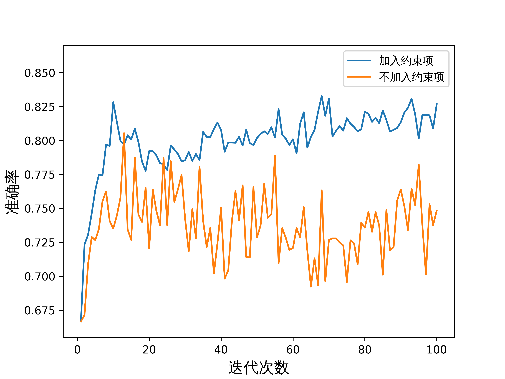

<h2 style="text-align:center;">Motivation</h2>

在完全的自动驾驶还未普及之前，高级驾驶辅助系统（ADAS）作为一种驾驶辅助手段得到了广泛的应用。ADAS的一个很重要的功能是前向预警，就是当前方有车辆逼近到一个安全距离以内时，系统会发出一个风险警告。但是由于当前的ADAS系统是一种通用的系统，而驾驶员可能有着不同的个体偏好，有的人激进，有的人保守，以致于通用的ADAS有时候会发出不符合该驾驶员特性的风险警告，这就导致了有些驾驶员嫌系统麻烦，即便装载了系统也不使用，这样辅助系统的作用就没办法发挥了。

而本项目就是希望研究一种方法，能帮助ADAS学到驾驶员的个体偏好，发出符合驾驶员个性的警告，从而让驾驶员愿意使用这样的系统，真正发挥出驾驶辅助系统的作用，减少交通事故的发生。
 

<h2 style="text-align:center;">Framework</h2>

本项目主要借鉴了instructGPT中使用的Reinforcement Learning with Human Feedback（RLHF）方法来搭建模型。我们首先采用YOLO检测算法和CNN-LSTM网络在自然驾驶视频数据上训练了一个基准风险评估模型。针对个体驾驶员，为实时获取驾驶员个体偏好的精确表达，我们利用其行车时的刹车与加速度数据，抽取出驾驶员在当前风险场景对高中低三种风险等级的排序结果，以训练奖励模型拟合个体偏好，使其能代替人来对基准模型输出的风险评估值进行打分。最后以最大化奖励模型的打分结果与最小化交叉熵损失作为双优化目标，用带有约束项的强化学习PPO算法更新基准模型，使基准模型能自适应拟合个体偏好。

 

<h2 style="text-align:center;">Methedology</h2>

1. **数据采集**

本项目自然驾驶数据来源于上海营运车辆的自然驾驶数据，共收集了1286个风险场景，其中单个样本数据集为12秒49帧的车辆前向视频数据。但通过数据的标定与筛选结果发现38个用户存在数据量少于80个，不满足建模需求的问题，印证了存在数据收集难、单一用户建模数据量不足的问题。且对驾驶员而言，如何对自己风险偏好精确打分并表述出来难度大，不同驾驶员的量化标准有较大差异。基于上述难题，我们对个体偏好进行细粒度解析，将风险划分为高中低三个等级，让驾驶员针对同一风险场景进行风险等级排序。排序结果通过两两组合得到三组排序，每组排序与其对应的风险场景都作为奖励模型的一条训练数据，实现了通过扩大数据量更好拟合个体偏好的目的。
 
2. **CNN-LSTM风险评估模型**

本项目采用卷积神经网络（CNN）和长短期记忆网络（LSTM）混合框架来构建基准风险评估模型\[1]。输入的数据经YOLO算法提取交互对象后和原始图像同时输入CNN的卷积层和池化层，提取图片特征。再通过LSTM提取视频时序特征，最后通过全连接层获得风险评估结果。
 
3. **个体偏好拟合**

本项目通过引入奖励模型拟合个体偏好。奖励模型的目标是代替人来对风险评估结果进行打分，以评价风险评估模型的风险感知偏好与人的匹配程度。奖励模型以风险场景和风险评估值作为输入两端，其中接收风险场景端的网络架构与基准模型相同，接收风险评估值端在接受向量输入后，与另一端的输出结果计算余弦相似度并得到最终输出。

训练奖励模型的过程中，用序号编码将高中低风险等级数值化为风险评估值。对于风险等级排序后的每组排序结果，用奖励模型对其中出现的两个风险等级分别计算得分，奖励模型以最大化排序在前的风险等级与排序在后的风险等级的得分之差作为优化目标，通过建立损失函数并以梯度下降方法做迭代更新。建立的loss函数公式如下：

$$\
loss(\theta)=-\frac{1}{C\_{K}^2}E\_{(x,y_w,y_t)\sim D}\[log(\sigma(r(x,y_w)-r(x,y_t)))]\
$$

上式中，r是对风险场景和风险等级对应数值化评估值的奖励值。D是整个训练数据集，K是训练数据集中训练样本数。
 

4. **自适应迭代**

在自适应迭代环节使用强化学习框架对基准风险评估模型进行微调。风险评估模型接收风险场景输入后输出风险评估值，并以奖励模型输出的得分作为**第一优化目标**。为避免模型在拟合个体偏好的过程中丧失基本的风险评估能力，还需计算风险评估值与实际标签的交叉熵损失作为第二目标来更新模型。为减轻训练样本中少量离群点对模型的干扰，在reward中加入KL惩罚因子作为约束项，防止模型因为离群样本而与基准模型偏离太多，提高模型更新过程的鲁棒性。综上，微调时的目标函数如下：

$$\
objective(\phi) = E\_{(x,y)\sim D}\[r(x,y) - \beta log(\pi^{RL}\_\phi(y|x)/\pi^{Base}(y|x))]\\
+\gamma E\_{x,y\sim D}\[log(\pi^{RL}\_\phi(x))]\
$$

上式中*D*是训练数据集，*β*是KL奖励系数， $\pi^{RL}\_\phi$是更新后的模型， $\pi^{Base}$是基准模型， $log(\pi^{RL}\_\phi(x))$ 是交叉熵损失， $\gamma$是交叉熵损失权重。

针对优化目标，采用PPO-截断算法构建损失函数并通过梯度下降算法迭代更新基准模型。

 
<h2 style="text-align:center;">Experiments</h2>

1. **数据可得性验证**

由于在实际应用中，通过每次给驾驶员观看大量风险视频数据来判断其风险偏好繁琐且不切实际。因此，我们需要通过驾驶员的驾驶行为来捕获其风险偏好，并据此生成个性化的风险评估模型。实验员在驾驶模拟器中对各类风险场景作出反应，通过刹车的踩踏幅度和方向盘的旋转角度推断其对该场景的风险排序，并与驾驶员观看模拟视频给出的风险排序进行比较，论证说明实际应用中通过驾驶行为得到个体风险排序的可行性。

本研究选取前车突然减速和侧向车辆切入两个典型风险场景进行模拟实验。

**前车突然减速**：根据上海自然驾驶数据集可知，跟驰过程中的车头时距服从对数分布，平均车头时距为2.052s。因此，本研究根据等距理论，分别取1.8s、2s和2.2s作为前车突然减速且减速度在2~8m/s2时的车头时距。

**侧向车辆切入**：在上海自然驾驶数据集中，切入事件导致的交通事故占高速公路事故总数的31.6%，其中车头时距的30%分位数为0.8s。考虑到模拟实验中车速过快，以0.8s为车头时距无法获得驾驶员真实的制动反应。因此，本研究分别取1s，2s，3s作为侧向车辆切入时的车头时距，切入车辆分别从右前方和左前方变道进入主车所在车道。

<table>
    <tr>
        <td width="30%">
            <figure>
              
              <figcaption>前车突然减速</figcaption>
            </figure>
        <td width="70%" height="100%">
            <figure>
              
              <figcaption>侧向车辆加入</figcaption>
            </figure>
        </td>
    </tr>
</table>
通过修改上述参数，我们得到共35个模拟风险场景。结合已有研究成果和本次实验设计，选取对风险排序的判断依据如下表所示。对比模拟实验中车辆纵向加速度曲线与驾驶员实际给出的风险排序（见下图），发现二者契合程度较高，表明通过驾驶行为得到个体风险排序具有可行性。

 
2. **个性化模型效果验证**

基准数据集包含1086条数据用于基准模型训练和验证，剩余200条数据构成个性化数据集，用于个性化模型的训练和验证。具有不同偏向的标注员基于排序机制在个性化数据集上做标注，得到一个保守数据集和一个激进数据集。经过数据增强后，在两个数据集上训练得到偏保守模型和偏激进模型。更新后的模型在两个数据集上的准确率与基准模型进行比较的结果见表2。偏保守模型、偏激进模型和基准模型在同一数据集上的风险评估输出分布如图7，表明模型能够适应不同驾驶员的个性化偏好。

<table>
    <tr>
        <td width="50%">
            <table border="1" cellspacing="0">
            <caption> 更新后的模型与基准模型比较 </caption>
                <tr>
                    <td align="center">驾驶员风格偏好</td>
                    <td align="center">模型类型</td>
                    <td align="center">准确率</td>
                </tr>
                <tr>
                    <td align="center">激进</td>
                    <td align="center">基准模型</td>
                    <td align="center">0.681</td>
                </tr>
                <tr>
                    <td align="center">激进</td>
                    <td align="center">激进模型</td>
                    <td align="center">0.832</td>
                </tr>
                <tr>
                    <td align="center">保守</td>
                    <td align="center">基准模型</td>
                    <td align="center">0.667</td>
                </tr>
                <tr>
                    <td align="center">保守</td>
                    <td align="center">保守模型</td>
                    <td align="center">0.855</td>
                </tr>
            </table>
        </td>
        <td width="50%" height="100%">
            <figure>
              
              <figcaption>三种模型风险评估输出分布</figcaption>
            </figure>
        </td>
    </tr>
</table>

为验证模型有效性，我们在偏保守数据集上做了进一步消融实验（训练过程准确率变化如图7-9）：

（一）针对风险等级排序机制，利用二分类标注数据训练的模型相比利用排序机制标注的模型准确率低，在准确率达到75%以后难以继续优化；

（二）针对双目标模型更新算法，除去交叉熵损失的单目标更新算法训练的模型，随着模型迭代次数增加逐渐丧失基本风险评估能力，准确率反而有下降趋势；

（三）针对模型更新约束项，在训练数据集中加入5%的干扰样本后，未加入约束项进行训练的模型在训练过程中准确率振荡幅度大，且难以进一步收敛。

<table>
    <tr>
        <td width="33%">
            <figure>
              
              <figcaption>分级消融实验验证</figcaption>
            </figure>
        <td width="33%" height="100%">
            <figure>
              
              <figcaption>双目标更新消融实验验证</figcaption>
            </figure>
        </td>
        <td width="34%" height="100%">
            <figure>
              
              <figcaption>约束项消融实验验证</figcaption>
            </figure>
        </td>      
    </tr>
</table>

通过进一步绘制出各模型的ROC曲线（如图10），可验证完备模型具有最佳的拟合能力。

 
<h2 style="text-align:center;">Discussion</h2>

1. 为什么不直接用个性化数据集来微调基准模型，而是使用RLHF方法，绕了一大圈再来微调呢？

有一篇论文\[2]的观点是RLHF能通过抽象人类的价值来学习，而不是简单模仿人类的行为，从而使得模型有更强的适应性。

还有一种解释是RLHF训练出的奖励模型综合了所有的人类价值判断，成了人的代理。相比片面的微调数据集来做基准模型的反馈，显然作为代理的奖励模型做出的反馈更具鲁棒性。
 

2. 同一个风险场景得到的三组匹配结果，是打散了到整个数据集中，还是放入一个batch中一次性训练？

在InstructGPT中是将同一个prompt的不同配对结果放到了一个batch中，因为如果打散了，很容易会让奖励模型过拟合，而且同一个prompt也会计算多次，大大增加了计算量。

我们暂时也是放在同一个batch中，但是这样计算实际会让排序在中间的风险等级对应的得分被抵消，虽然可以减少计算中间风险等级的得分的这部分计算量，但感觉没有对这种排序做充分的利用。而如果打散在整个数据集中，是否也会过拟合呢？我们还没有做实验，但感觉值得做进一步探索。
 
#### My Summary

深度学习的二八定律诚不欺我，20%的时间用来搭建模型，80%的时间用来调参。不管是构建的奖励模型还是强化学习模型一开始都无法很好的收敛。在训练奖励模型时，训练损失下降了但验证损失总不下降，给模型加上dropout，换了几次优化器，然后慢慢调学习率、batchsize、模型层数和模型中间输出维度；在训练强化学习时，测试精度振荡幅度很大不收敛，可能时用来测试的数据量太少，于是先尝试数据增强，再调各种超参数。

我感觉最繁琐的就是修改配置文件、保存实验结果以及记录实验参数的过程，由于实验的参数比较多，有的参数相互关联，修改参数需要确保修改合理，非常需要细致严谨的功夫，一不注意，可能一天的等待结果完全白费了。而对实验结果有条理地记录也非常重要，后来想应该从一开始就用一张大表记录每次实验的各参数取值，可惜当时因为觉得麻烦没这么做，导致后来实验越做越混乱，重复实验的风险也大大增加了。

这次经历让我走出一个误区，科研不像创新课题，idea固然很重要，但实验可能更重要。别看一篇论文前面讲原理的部分很长、后面实验部分相对较短，实际上背后的付出可能后者是前者的几倍。实验的验证也不是改个变量来重复实验这样简单，从虚处讲它需要实验者严谨求实、细心审慎的精神，而从实处讲如何找到一个指标或者实验来验证研究的创新，也是一个不亚于研究本身的研究。
 
#### Acknowledge
*感谢余荣杰教授的指导与对项目的建议；感谢谢宁学长对我们每个难题的细致讲解、对我每次迷茫的耐心解惑；感谢组长和两位组员的付出与帮助，让我在这次项目中不仅收获到专业技能的提高，还感受到彼此信任的可贵。*
 
#### Reference
[1] R. Yu and H. Ai, Vehicle Forward Collision Warning based upon Low Frequency Video Data: A hybrid Deep Learning Modeling Approach[J]. 2022 IEEE 25th International Conference on Intelligent Transportation Systems (ITSC), 2022, 59-64.
[2] Liu G K M. Perspectives on the Social Impacts of Reinforcement Learning with Human Feedback[J]. arXiv preprint arXiv:2303.02891, 2023.
