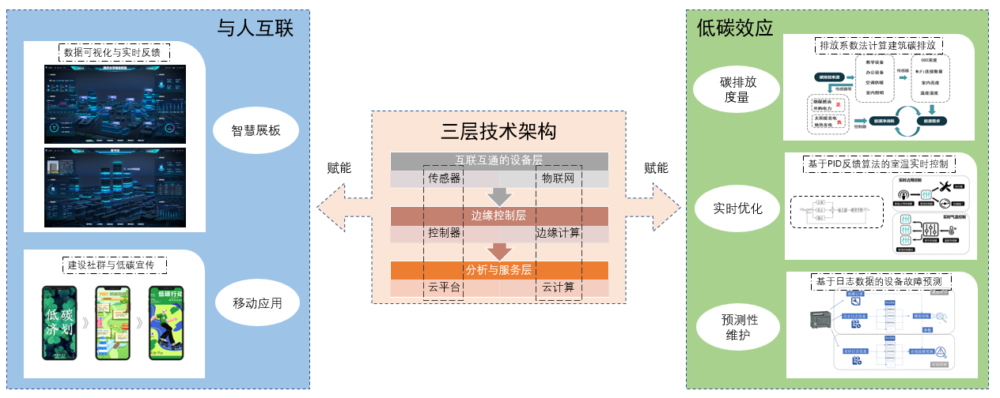

> Tip: \
> 在这里我将对项目做一个较为详细的介绍，\
> 除了方法上的细节，还会夹带一些个人的经历与体会。\
> 对于我来说，这既是一个总结，也是一种更有特色的呈现。\
> 希望这能让你更了解我走过的历程，同时也希望能给你带去一点小小的启发~

首届“启迪班”创新课题比赛以“低碳校园”为主题，要求在一个月左右的时间调研设计并产出一个科学可行的解决思路。
我们小组六人分别来自于六个不同的学院，涵盖机械、人文、交通、土木等专业，专业认知方面可谓隔了几层山。而要从一个月从不相识到产出成果，是一个相当不小的挑战。

<h3 style="text-align:center;">确定方向🧭</h3>
“开放式主题”最难的就是确定一个明确的研究方向，而对于我们这样一个学科非常交叉的小组，更是“雪上加霜”。通过前期调研，我们提出了多个不同的方向，有像“校园停车管理”、“垃圾降解与回收利用”、“建筑单体低碳改造”这样相对传统的方向，也有“智慧平台”、“物联网”、“数字孪生”这样更“互联网”式的选题。

我们对这些方向做了激烈的讨论。因为专业差距大，有的方向我认为很好但你不懂或者你觉得重要我却不以为然。通过反复的讨论和不得不做出的妥协，初步遴选出了三个方向来做最后的选择：建筑单体的智能改造、校园土地利用与规划和低碳校园智慧平台。

不出所料，对剩余的三个方向依然分歧很大，突然有人说，要不将两个方向合并一下做一个课题？对啊，何必要非此即彼地做选择呢？不如像个大人一样“全都要”。对于创新课题来说，不同方向融合反而留下更多余地，也能萌发更多创新点。最终，我们决定将绿色单体建筑与校园智慧平台相结合，确定了课题的基本方向。
而进一步挖掘方向，我们又延伸出了多个可以针对研究的具体问题，包括建筑中的节能系统、建筑中的数据分析、社群平台的运营等。通过对文献的深入研究与一次次讨论磨合，我们确定项目将以校园建筑智慧平台为中心，并以此为原点辐射出IT技术架构、数据分析、人工智能、社群运营这四个研究子方向。

> 问题往往是越辩越明的。不必担心意见的多样性，虽然一开始会因此而纠结，但“兼听则明”，只有扩大搜索范围，才有更大可能找到全局最优解。不过也需掌握一个trade-off，一味扩大选题会消耗掉很多资源与精力。
>
> 此外，一开始就确定一个基本的框架并构想最终呈现结果是非常重要的。并在项目实施过程中不断思考什么在框架中是主要的、什么是次要的，以此来指引对后续研究内容的调整。

<h3 style="text-align:center;">项目框架💡</h3>

#### 三层技术结构：

我们提出的校园低碳建筑智慧平台的技术架构分为三层：**互联互通的设备层**用来收集数据；**边缘控制层**用来做边缘计算并实时反馈；**分析与服务层**用来集成与统摄数据，完成更复杂的数据分析，并为移动端服务提供接口。

在互联互通的设备层，**传感器技术**作为平台系统与现实建筑的桥梁，是采集数据的重要工具。它们可以监测建筑内外的环境数据以及建筑中各种控制系统的控制数据，成为平台数据获取的来源。

在边缘控制层，由集网络、计算、存储、应用功能为一体的控制器实现**边缘计算**功能，在靠近数据源头的一侧就近提供低时延的数据存储与数据分析服务。控制器支持Zigbee技术，实现低成本、低功耗、自动组网、易于维护、可靠性高的无线通信。同时，控制器内置编程端口，可以自定义算法实现计算与控制逻辑。

在分析与服务层，通过利用**云平台**存储、备份和整合历史设备和系统数据，赋能**数据处理**和**机器学习**训练，为更复杂的数据分析提供计算资源。

#### 低碳效应

基于三层技术架构，我们设计的校园低碳建筑智慧平台可以在三个领域发挥低碳效应：

首先是**碳排放计算**，系统通过传感器采集建筑内的实时数据，使用**排放系数法**计算建筑中各种设备的碳排放，并通过在楼宇中公开的智慧平板**实时反馈**楼宇碳排放信息，起到对楼宇低碳建设的监控与警示作用，引起校园师生对低碳理念的重视。

第二个是**实时优化**，由于环境变化与人流流动，校园楼宇的照明、温度等环境量的控制系统应该处于动态变化中，才能实现能源的最有效利用。平台传感器对气温、水温、CO2浓度、相对湿度等数据量进行采集，控制器通过对信号的收集与处理，使用控制算法指示执行器对阀门开关做调控，从而实现对水、新风和气体流动的精准控制。实时控制采用基于反馈回路的稳定性调节，利用比例-积分-微分（PID）回路算法，对条件作出响应，增量调整执行器和阀门，以更好地维持系统稳定性。这种基于边控控制实现的实时优化，有低时延、低带宽的优势，并且有效保护隐私，防止数据外泄。

第三个是**预测性维护**，即在设备出现故障之前对可能出现的故障做出预警，有数据显示，通过主动预测性维护，项目能够节省高达20%的维护和能源成本，有巨大低碳价值。一种方式是对设备日志信息做故障预测，分为离线学习和在线预测两个部分，在离线学习部分，通过对历史日志信息做特征提取，与故障记录结合训练机器学习模型；在在线预测部分，对实时日志信息做特征提取，并使用训练后的模型来做在线故障预测。

#### 与人互联

系统可以与人互联，发动校园师生参与到低碳环保的活动中来。基于此校园低碳建筑智慧平台，开发基于云基础设施的**服务平台**，包括Web服务、智慧展板服务和移动端服务。**Web服务**可以辅助建筑管理和人事安排，**智慧展板**可以对建筑实时数据做可视化，并对设备状态做监控，**移动APP**可以远程监控和维护设备，并打造低碳社群。

与人互联最有创新性的部分是在校园内打造一个开放、活跃的**低碳社群**。基于可视化的建筑节能数据，搭建一个以低碳生活为核心理念的线上社群平台，在平台内设置校内论坛、积分排名制度、线下活动联络区等版块，激励同学们低碳行动、低碳生活，形成绿色、协调、共享的学校社群文化。

项目的总体架构如下图：

以三层架构作为技术支撑，在三个现实领域实现低碳效应，并通过与人互联引领低碳价值观念，本项目设计的校园低碳建筑智慧平台可以为校园低碳建设提供一个有价值的解决方案。

### 收获：

本项目由于时间的限制，很难产生实际的成果，因此最终评价的标准主要在于想法的独创性与完整性，而落实到对参赛队伍的考验，则主要在考察查文献的能力、对知识综合利用的能力，以及讲故事的能力。

通过这次项目，我们完整体验了从确定方向到文献调研，再到提出项目框架，并最终确定具体解决方案的课题全流程。通过与多个学院同学的团队合作，既磨炼了协调的能力，又让我有了看待问题的不同方式。而最后制作ppt与做项目汇报，也让我学会了如何把我们准备的故事简明扼要地表达出来，让他人能理解并认可我们的成果。

### 感谢

*感谢一月相伴共度难关的同学，我们共同的努力才获得了这样了不起的成果，也是从这里开始，我收获了一份宝贵的自信！*