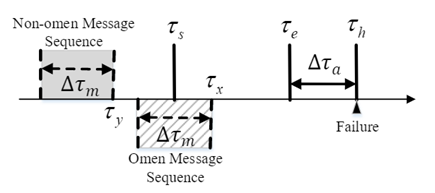
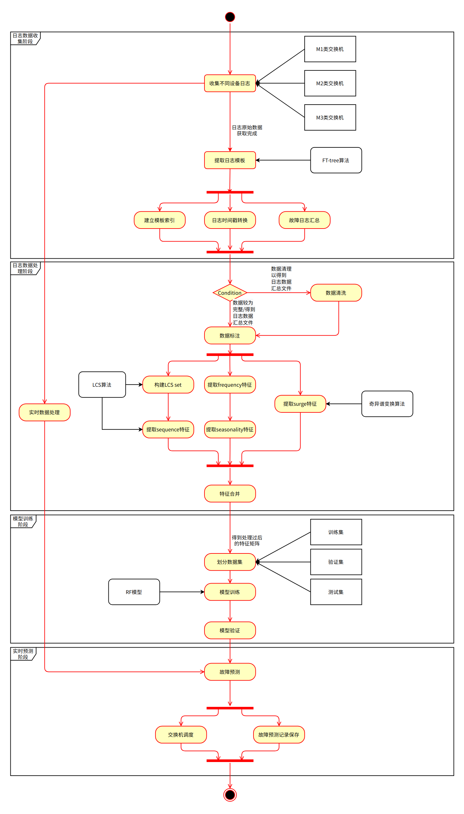

> Tip: \
> 在这里我将对项目做一个较为详细的介绍，\
> 除了方法上的细节，还会夹带一些个人的经历与体会。\
> 对于我来说，这既是一个总结，也是一种更有特色的呈现。\
> 希望这能让你更了解我走过的历程，同时也希望能给你带去一点小小的启发~
 

<h2 style="text-align:center;">Motivation</h2>
项目是主要时对时间序列做预测，感觉和NLP比较相通。一方面文本也可以看作一种时间序列，另一方面序列中每一个时间步的日志也是一种文本数据。可以说这个项目是对前面NLP项目的一个很好的延续。

在做项目前还阅读了一些用transformer解决时间序列问题的英文论文，在阅读时我仅在单词级别查询翻译，虽然读的速度很慢，但能感觉到自己英语阅读能力的提高。养成习惯以后英语六级的阅读差不多可以秒杀了~

<h2 style="text-align:center;">Methodology</h2>

这篇论文中最关键的部分是 **对日志时间序列的处理** ，而模型部分只是使用 **随机森林** ，比较简单。

第一步是对**日志文本的处理**，文中使用**FT-tree**这种日志解析方法来从非结构化的日志文本中提取出统一的模板，再对模板做**序号编码**，以序号作为模板的表示。于是可以将按时间顺序排列的日志序列转换成一个序号序列。

第二步是做**序列拆分**。用一个长度为2小时的**滑动窗口**在时间序列上以15分钟为步长滑动。每次滑动时，窗口所覆盖的时间段内的日志组成的小段序列（被称为**time bin**）被视为一条数据，以滑动窗口的末尾时间作为这条数据的时间标识。每条数据的标签生成规则如下图：

如果在$\tau_h$时间点发生故障，则时间标识在$\tau_s$和$\tau_e$之间的time bin被标记为**有故障的time bin**，除此之外被标记为**无故障的time bin**。因此故障预测的任务可以抽象为对当前time bin做有故障和无故障预测的**二分类任务**。

第三步是**特征提取**，也是这篇论文中最重要的一步。针对每个time bin中的小段序号序列（前面已经将日志转换成对应的序号），我们需要生成它的**向量表示**。而向量表示是由这段序列的**四个特征**拼接而成的，包括frequency特征、seasonality特征、sequency特征和surge特征这四种。
frequency特征就是对每种日志模板计算在这个time bin中出现的次数，将次数拼接起来作为这个特征的向量；
seasonality特征则是基于下列公式计算出的值：

$$\
D^{\prime}\left(\rho, t_j\right)=\frac{D\left(\rho, t\_j\right)}{\frac{1}{\rho} \sum\_{k=1}^\rho D\left(k, t_j\right)}(1)\
$$

$$\
D ( \rho , t \_ { j } ) = \sum \_ { k = 1 } ^ { h - \rho } ( C \_ { \xi } ^ { k } ( t \_ { j } ) - C \_ { \xi } ^ { k + \rho } ( t \_ { j } ) ) ^ { 2 }(2)\
$$

其中$\rho \in { hour, day, week, month }$，是由领域知识确定的一系列可能的周期值；$\mathrm{C}^{k}_{\xi}\left(t_j\right)$指第k个time bin中模板$t_j$的出现次数（由上面frequency特征计算的结果获得）；
sequency特征是使用**双重LCS算法**，先对所有**有故障的time bin两两之间做LCS**，把所有LCS的结果序列构成一个集合。然后对所有time bin，逐个将之与故障集合中左右的序列再做一次**基于LCS的相似度计算**，以**相似度结果**作为这个time bin的特征取指，体现它与故障time bin之间的相似性；
surge特征则是对每一个time bin以2秒为间隔做切分，对每一个分块内的每一种模板计算出现次数，再用**奇异谱变换方法**，以模板的频率序列为输入，输出一个该模板的得分。
所有模板的得分拼接起来作为一个该特征的向量。上述四个特征对应的向量或数值拼接起来组成的长向量（达五百多维）即作为该time bin的特征表示。

第四步，就是将这些数据做训练集和测试集的划分，再放到模型中做训练和测试了。

* 个人任务与最终结果

在本项目中，我主要负责代码框架的搭建（主要参考[这篇教程](https://github.com/chenyuntc/pytorch-book/blob/master/chapter06-best_practice/PyTorch%E5%AE%9E%E6%88%98%E6%8C%87%E5%8D%97.md)）、序列拆分和seasonality特征提取的代码实现。

最终复现结果为：

  
## 复现结果
  
| Method | Precision | Recall | F1    |
| ------ | --------- | ------ | ----- |
| 原论文结果  | 0.874     | 0.744  | 0.803 |
| 复现结果   | 0.873     | 0.575  | 0.683 |
  

<h2 style="text-align:center;">Summary</h2>
读代码与自己写代码完全是两回事。读代码可能只需要用十几分钟看看输入输出和中间的几个关键操作就能大概了解一段代码的功能。而当真正需要自己来写这样的代码时，可能需要整整一天。

<h3 style="text-align:center;">Acknowledgments</h3>
感谢石晓楠学姐和吴嘉琦学长给我们的指导！
