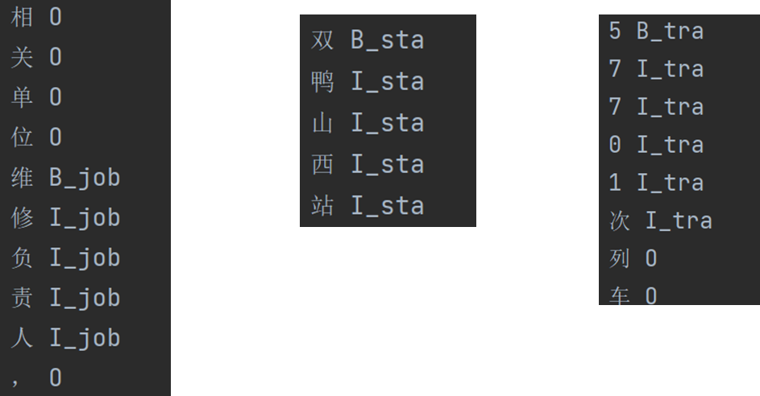
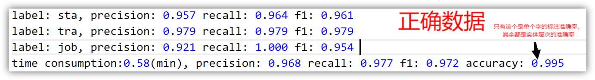
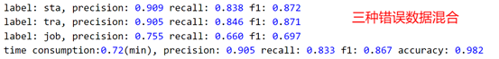
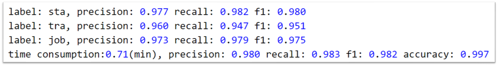
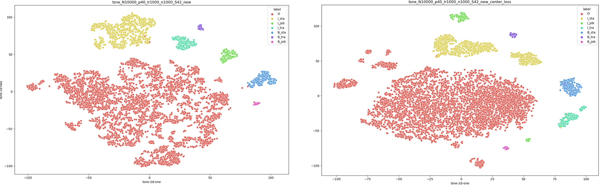

> Tip: \
> 在这里我将对项目做一个较为详细的介绍，\
> 除了方法上的细节，还会夹带一些个人的经历与体会。\
> 对于我来说，这既是一个总结，也是一种更有特色的呈现。\
> 希望这能让你更了解我走过的历程，同时也希望能给你带去一点小小的启发~

 
<h2 style="text-align:center;">初窥门径</h2>
  这是我的第一个深度学习项目。如何入门一个新的领域呢？最经典的办法，是找一本教材从头开始建立知识体系。于是我选中了[《动手学深度学习》] (https://zh-v2.d2l.ai/index.html) ，并搭配其配套的[网课] (https://space.bilibili.com/1567748478/channel/seriesdetail?sid=358497) 。
<figure>
  
  <figcaption>《动手学深度学习》</figcaption>
</figure>
 

<h2 style="text-align:center;">项目立项</h2>

我找了四位同学组队，开展对这项任务的调研。我们首先将任务划归为NLP领域里的一项基本任务—— **命名实体识别**（ **NER**），并决定采用 **预训练+微调** 的模式来训练模型。我们对NER领域的模型展开进一步调研，并确定使用经典模型 **Bert-BiLSTM-CRF**开展实验。
<figure>
  
  <figcaption>Bert-BiLSTM-CRF</figcaption>
</figure>

我们将调研结果和技术路线等做了总结后申请双创项目，并最终申请到了上海市创新创业项目的立项。
 

<h2 style="text-align:center;">项目开展</h2>

我们拿到了几万条真实调度命令数据，并对其中2000条做了标注。在github上找到一份合适的代码以后，我先做了一个简单的 **数据预处理**，删除其中一些特殊符号，并将标注数据转换为能被模型读入的BIO标注格式。然后将数据放入模型中做训练和测试，很快得到一个相当不错的结果。

<figure>
  
  <figcaption>用BIO标注法标注数据</figcaption>
</figure>

<figure>
  
  <figcaption>模型在标注数据集上训练后的测试结果</figcaption>
</figure>

我们任务的关键目标是能在有错误的文本中提取出关键信息，但目前我们的数据中错误是相当少的，不能检验模型对错误信息的识别精度。于是基于老师的描述，我们设计了三条错误生成规则（随机重复一个字、随机删除一个字、随机对两个字做调换）来对原测试数据做 **错误数据生成** ，模拟实际场景中可能出现的错误。用我们之前训练好的模型在这个错误数据集上测试，发现F1得分有所下降。

<figure>
  
  <figcaption>模型在错误数据集上测试的结果</figcaption>
</figure>

最naive的优化想方法，就是将生成的错误数据和原始数据混在一起以后拿来训练，即 **数据增强** 。模型通过训练“认识”了这些错误，自然在测试时能有更强的识别错误信息的能力。
<figure>
  
  <figcaption>经过错误数据训练的模型的测试结果</figcaption>
</figure>

模型还可以怎么优化呢？还可以在 **损失函数** 上下功夫。本来模型中的损失是直接通过CRF层计算的，我们可以另外加入一个损失函数来进一步调整模型训练的方向，比如**center loss**。centor loss能学习每种标签的中心来提高对每个token的特征表示能力，从而提高其分类准确度。通过对模型中间层的输出结果做 **t-sne可视化** ，可以比较加了center loss与没加的区别。
<figure>
  
  <figcaption>左边没有加入center loss，右边加入了center loss</figcaption>
</figure>

加了center loss的图中，相同颜色的点更加聚集，说明模型能使同一类别的字的输出之间更加近，能更好地分辨不同类别的词。
 

### 个人总结
总体来看这个项目还是比较简单的，它主要是在工程上的应用，基本没有提出创新的方法。我在项目开展的过程中很少能提出自己的见解，基本都是跟随老师的指示，倒是像一个课程大作业了。但现在来看这真是一个极佳的深度学习入门项目，任务简单、模型成熟，在学过基础知识以后能立刻通过项目代码来巩固所学，理论与实践结合应该是最佳的学习方式吧。这次项目虽然没有手写深度学习代码，但通过逐行阅读其他人的项目代码，也是一种相对简单的积累编程经验的方式。这是我入门深度学习的第一步。可以说，这里是 *“梦开始的地方”* 。
 

### 从工程到科研
项目做到这里，主要还只是在解决工程问题，如何从工程上升到更有普适意义的科研？学长给了我们两点建议：

1. 研究有错误实体的中文文本的命名实体识别问题。查找论文似乎很少有关注这个方面的研究，但这却是我们项目中的核心需求，因此可能是一个有价值但尚未被发掘的方向。
2. 只需使用少量数据做训练的迁移学习。在应用落地以后，可能会产生新的关键信息类型，而模型要能识别它们，又需要再标注新的数据并重新训练，这会带来持续的维护成本。找到一种方法让模型仅用少量标注数据或者不需要标注数据就能识别新的关键信息类型，也是一个有价值的研究方向。

针对问题一，英文领域的spelling correction问题和我们的问题很像，其中有使用到的方法，比如使用掩码策略、使用transformer架构等可能都值得一试。

针对问题二，可以用few-shot learning的方法。在NER领域，有使用对抗学习方法来训练通用的sentence encoder再做迁移的，还有使用抽象的CRF层做迁移的等等。
 

#### 感谢
*在此感谢张苗苗老师对我们项目的支持和对我的关心；感谢杜博闻学长给我们的项目指明方向，每次我们遇到困难时总能给我们鼓励和建议；感谢四位组员的付出，共同探索与共同学习的过程都是最珍贵的回忆。*
