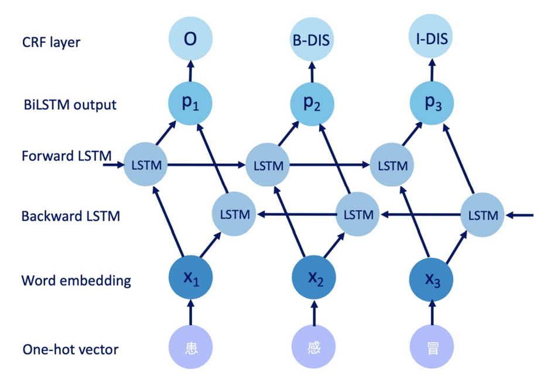
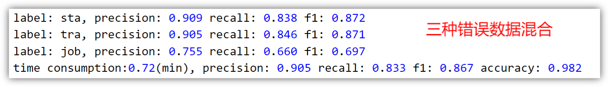

> Tip: 在这里我将对项目做一个详细的介绍，除了方法上的细节，还会夹带一些个人的经历与体会。对于我来说，这既是一个总结，也是一种更有特色的呈现。希望这能让你更了解我走过的历程（得到他人的理解也是人的基本需要吧），也希望能给你带去一点小小的启发。

<h1 style="text-align:center;">初窥门径</h1>
这是我的第一个深度学习项目。那时我对深度学习一窍不通，如何入门？按照最传统的想法，是找一本教材。于是我选中了《动手学深度学习》，并找到了其配套的网课。
<figure>
  
  <figcaption>《动手学深度学习》</figcaption>
</figure>

所谓万事开头难，刚开始就卡在了第二节课——配环境。对于视频中出现的虚拟环境、框架、GPU、CUDA等概念，我全然不知；看着老师熟练地操作与写意式地教授，我深感绝望。在一遍遍重复播放视频，并去查其他的教程后，用了几天时间，终于在本地勉强搭好了环境，才开始后来的学习。

> 复盘：后来才了解到配环境是大多数初学者的一道门槛，可当时不知道，于是大受挫败。我当时硬碰硬地死磕难题，虽然最后也算解决了，但感觉并不划算，可能一开始绕过问题以另一种方式开始（比如直接用课程提供的colab环境）会更好，因为这样的难题随着学习的深入和理解的加深会变得简单，而**以最简单的方式开始，既有效率又让事情更简单**。

**项目研究：**

1. 项目立项

我找了四位同学组队，开展对这项任务的调研。我们首先将任务划归为NLP领域里的一项基本任务——**命名实体识别**（**NER**），并决定采用**预训练+微调**的模式来训练。我们对NER领域的模型展开进一步调研，并确定先使用经典模型**Bert-BiLSTM-CRF（如图）**开展实验。

我们将调研结果和技术路线等做了总结后申请双创项目，并最终申请到**上创**。

2. 项目开展与结果

我们从老师那拿到几万条真实调度命令数据，并对其中2000条做了标注。在github上找到一份合适的代码以后，我先做了一个简单的**数据预处理**，删除其中一些特殊符号，并将标注数据转换为能被模型读入的BIO标注格式，**如图**。然后将数据放入模型中做训练和测试，很快得到一个相当不错的结果（**如图**）。

我们想到我们任务的关键目标是能从有错误的文本中依然提取出关键信息，但目前我们的数据中错误是相当少的，不能检验模型对错误信息的识别精度。于是基于老师的描述，我们设计了三条错误生成规则（随机重复一个字、随机删除一个字、随机对两个字做调换）来对原测试数据做**错误数据生成**，模拟实际场景中可能出现的错误。用我们之前训练好的模型在这个错误数据集上测试，发现指标有所下降**（如图）**。

最naive的想法，就是将生成的错误数据和原始数据混在一起直接拿来做训练（规范点说就是**数据增强**）。直觉来说结果当然会有提升，果不其然得到**如图**的结果：

模型还可以怎么优化呢？带我们的博士生学长说，可以**优化损失函数**，本来模型中的损失是直接通过CRF层计算的，我们可以尝试加入第二个损失函数来训练模型，比如center loss或angular loss（似乎是CV里面常用的方法），并对模型中间层的输出结果做**t-sne可视化**来比较加与没加的区别。于是我们在原代码上加了**center loss**的实现，得到下面**图**的对比结果：

加了center loss的图中，相同颜色的点更加聚集，说明模型能使同一类别的字的输出之间更加近，更好地分辨不同类别的词。

* 收获

这是我大学以来争取到的第一个项目，也是我入门深度学习的第一脚。虽然没有手写深度学习代码，但我也逐行阅读了找来的项目代码，算是有了初步的实践经验。我很少读论文（因为还不适应英文论文），但也学会利用各种中文渠道来定义和研究问题，可以说是个人科研的开端吧。同时，组织团队一起开展项目、写项目报告、做项目汇报这些工作，也给了我不少挑战。可以说，这里是*“梦开始的地方”*。

* 从工程到科研

项目做到这里，主要还只是在解决工程问题，如何从工程上升到更有普适意义的科研？博士生学长给我们了两点建议：

1. 研究中有错误实体的中文文本的命名实体识别问题。查找论文似乎很少有关注这个方面的研究，但这却是我们项目中的核心需求，因此可能是一个有价值但尚未被发掘的方向。
2. 使用少量数据的迁移学习。因为应用落地以后可能会产生新的关键信息类型，而模型要能识别它们，又需要再标注新的数据并重新训练，带来一些模型的维护成本。是否能找到方法让模型仅用少量标注数据或者不需要标注数据就能识别新的关键信息类型？

针对问题一，我发现英文领域的spelling correction问题和我们的问题很像，有些解决问题的方法比如使用掩码策略、使用transformer架构等可能都值得一试。

针对问题二，可以用few-shot learning的方法，我了解到在NER领域，有使用对抗学习训练通用的sentence encoder再做迁移的，有使用抽象的CRF层做迁移的，也都值得一试。

因为此时已经是一年以后，没有时间去做实验尝试。只好看将来有没有机会继续探索了。

*在此感谢张苗苗老师对我们项目的支持和对我的关心，您能与我多次交流，并给出有启发的建议，给予了我莫大的帮助。感谢杜博闻老师给我们的项目指明\
  方向，在每次我们遇到困难时总能给我们鼓励和建议，带领我们完成项目。感谢我的组员们，项目的完成离不开你们的付出，共同学习与解决问题是最珍贵的回忆。*
